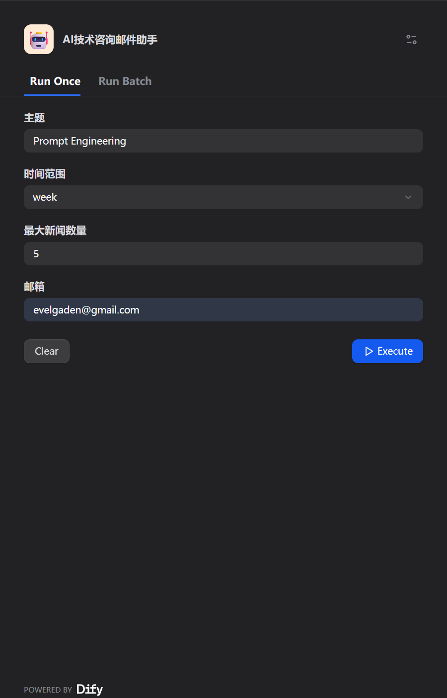
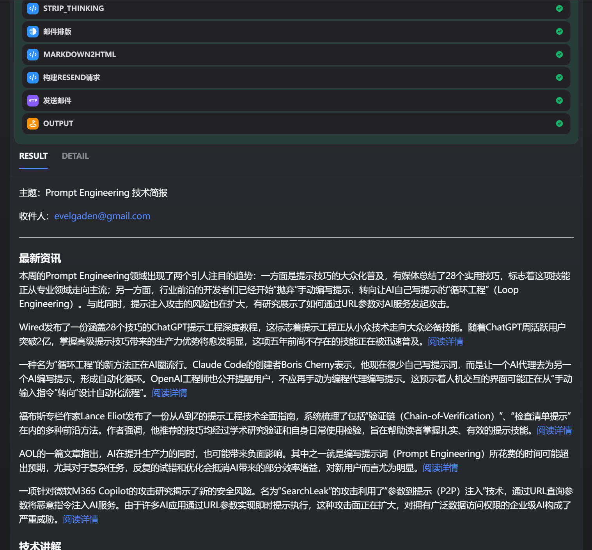
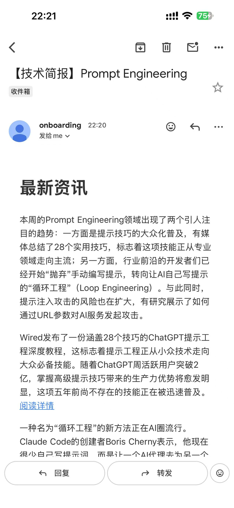

# 使用 Dify 创建一个“相关技术简报邮件生成助手”

点击 [App](https://udify.app/workflow/bc8vorrwf2DNCg3p) 试用

<table align="center">
  <tr>
    <td align="center"><b>首页输入</b></td>
    <td align="center"><b>运行输出</b></td>
  </tr>
  <tr>
    <td></td>
    <td></td>
  </tr>
  <tr>
    <td align="center" colspan="1"><b>邮件预览</b></td>
  </tr>
  <tr>
    <td align="center" colspan="1"></td>
  </tr>
</table>

输入想要了解的技术关键词，就能得到一封包含技术讲解和最新新闻要点的简报邮件。

**Version 1.0:**

最小流程，输入 -> 搜索 -> 处理 -> 生成/发送邮件。

**遗留问题**：

- 使用多个搜索节点分别搜索新闻和技术实现，合并结果处理。

- 搜索有时会为空，没有重试机制。

- markdown 文本没有转换成邮件的富文本格式，邮件看起来不好看。

- 发送邮件处于测试阶段，未配置 domain 实现发送到任何人的功能。

**Version 2.0**

分成“新闻”搜索和“最佳实践”搜索，拼装结果给模型。

增加了去除模型思考过程记录和转换 markdown 为 html 格式的代码节点。

**遗留问题**：

- 邮件内容能看了，但是模板和排版还是不够美观。

- 模型的思考过程去除得不全面。

- 未达到生成级别，不能向任何人发送邮件。
