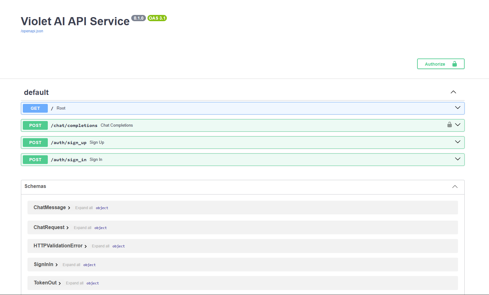

# 手写一个 LLM API 网关后，我发现最难的不是调通大模型

不用 LangChain、不用任何 Agent 框架，从零手写了一个 LLM API 网关：注册登录、JWT 鉴权、每日额度限制、对话补全、SSE 流式输出。动手前我以为最难的是调通大模型接口。实际上调通只花了半天，剩下的时间全花在了错误处理、异步客户端的生命周期、以及流式响应下的状态一致性上。这三件事教程里几乎不讲，但它们才是"能跑的脚本"和"能上线的服务"之间的全部差距。

## 一、先看成品

**FastAPI docs**：



**非流式响应**：

```ps
PS E:\Workbench\Personal\python\llm_lab> curl -X POST http://localhost:8000/chat/completions `
>> -H "Content-Type: application/json" `
>> -H "Authorization: Bearer <...>" `
>> -d '{"messages": [{"role": "user", "content": "用两句话解释什么是agent"}], "model": "deepseek-chat"}'
{"content":"Agent（智能体）是一种能够自主感知环境、做出决策并执行行动的计算实体。它通过“感知—决策—行动”循环，在特定环境中独立完成任务，而无需人类逐步干预。","model":"deepseek-v4-flash","usage":null}
```

**流式响应**：

```ps
PS E:\Workbench\Personal\python\llm_lab> curl -X POST http://localhost:8000/chat/completions `
>> -H "Content-Type: application/json" `
>> -H "Authorization: Bearer <...>" `
>> -d '{"messages": [{"role": "user", "content": "用10个字解释什么是agent"}], "model": "deepseek-chat", "stream": true}'
data: {"content": "智能"}

data: {"content": "体"}

data: {"content": "自主"}

data: {"content": "感知"}

data: {"content": "决策"}

data: {"content": "行动"}

data: {"content": "。"}

data: [DONE]
```

**额度耗尽**：

```ps
PS E:\Workbench\Personal\python\llm_lab> curl -X POST http://localhost:8000/chat/completions `
>> -H "Content-Type: application/json" `
>> -H "Authorization: Bearer <...>" `
>> -d '{"messages": [{"role": "user", "content": "用10个字解释什么是agent"}], "model": "deepseek-chat"}'
{"error":{"code":"QUOTA_EXCEEDED","message":"额度不够"}}
```

代码的组织长这样：

```txt
ai_service/
├── app/
│   ├── main.py            # 路由：只做协议转换
│   ├── api/deps.py        # 依赖注入：鉴权
│   ├── services/          # 业务规则：注册登录、额度、对话
│   ├── repositories/      # 存取：用户数据的读写
│   ├── llm/               # 上游适配：把厂商 API 包成自己的接口
│   ├── schemas/           # 数据契约：pydantic 模型
│   └── core/              # 跨层设施：配置、异常、异常处理器、令牌
├── data/users.json        # 用 JSON 文件充当数据库
└── tests/
```

这个结构不是一开始就有的。我的第一版是所有逻辑都堆在 `main.py` 里：路由函数里直接读 JSON 文件、直接 `raise HTTPException`、直接拼 DeepSeek 的请求体。能跑，但每加一个功能都要在同一个函数里改，而且改完不敢确定有没有碰坏别的东西。后来分层的依据很简单，就一句话：**每一层只允许知道一件事**。路由层只知道 HTTP，service 层只知道业务规则，repository 层只知道怎么存取，`llm/` 只知道厂商的接口长什么样。后面几节踩的坑，本质上都是这条边界没划清导致的。

## 二、鉴权：把"当前用户"变成一个类型

对话接口不能对匿名用户开放——每次请求都在花我自己的 API 额度。所以服务必须先回答一个问题：这个请求是谁发的？

### 为什么是 JWT 而不是 session

session 的做法是服务端存一份会话表，客户端只拿一个 session id。JWT 反过来：把用户标识和过期时间签进令牌本身，服务端不存任何东西，只验签名。

```python
# app/core/security.py
def create_access_token(subject: str, expires_minutes: int = ACCESS_TOKEN_EXPIRE_MINUTES) -> str:
  payload = {
    "sub": subject,
    "exp": datetime.now(timezone.utc) + timedelta(minutes=expires_minutes)
  }
  return jwt.encode(payload, JWT_SECRET_KEY, algorithm=ALGORITHM)
```

对一个 API 服务来说，无状态是实打实的好处：不需要额外的会话存储，多开几个进程也不用考虑会话怎么共享。

但它的代价必须说清楚：**令牌一旦签出去，在过期之前你没法作废它**。服务端手里没有会话表，也就没有可以删掉的东西。所以我把有效期设成了 60 分钟——短过期是这套方案里唯一廉价的补救手段。真要做到"立刻踢下线"，就得再引入一个黑名单，那时候你其实又回到了有状态。

### 为什么密码哈希要选一个"慢"的算法

我原本以为存密码就是"别存明文"，`sha256` 一下就行。这个想法是错的，而且错在一个反直觉的地方：**哈希算法的快，在这个场景里是缺陷**。

`md5`、`sha256` 这类算法是为校验大文件设计的，追求的就是快。快意味着攻击者拿到你的数据库之后，可以用极高的速度去撞库和暴力枚举。密码哈希需要的恰好相反：慢，而且慢得可调。

```python
# app/services/auth_service.py
def hash_password(plain: str) -> str:
  hashed = bcrypt.hashpw(plain.encode(), bcrypt.gensalt())
  return hashed.decode()


def verify_password(plain: str, hashed: str) -> bool:
  return bcrypt.checkpw(plain.encode(), hashed.encode())
```

`bcrypt` 帮我做了两件我自己很容易做错的事。一是 `gensalt()` 自动生成随机盐并写进结果字符串里，所以两个用户用同一个密码，存下来的哈希也完全不同，彩虹表直接失效；二是它的计算成本是一个可以调的参数，硬件变快了就把成本调高。

顺带一个细节：`verify_password` 用的是 `checkpw` 而不是自己算一遍再 `==` 比较。后者会因为字符串比较提前返回而泄露时序信息。这种"看起来等价"的手写实现，是安全代码里最常见的坑。

### 依赖注入把鉴权收敛成一行类型标注

拿到令牌之后要做三件事：从 `Authorization` 头里取出 token、验签并解出用户标识、拿标识去查用户。如果写在每个受保护的接口里，就是每个接口都抄一遍这三步，而且抄漏一个接口就是一个安全漏洞。

FastAPI 的解法是把这三步写成一个依赖函数，然后给它起个类型名：

```python
# app/api/deps.py
def get_current_user(
  cred: Annotated[HTTPAuthorizationCredentials, Depends(security)]
) -> UserRecord:
  token = cred.credentials
  try:
    payload = decode_access_token(token)
    email = payload.get("sub")
  except jwt.PyJWTError:
    raise HTTPException(status_code=401, detail="无效或过期令牌")

  user = get_user(email)
  if user is None:
    raise HTTPException(status_code=401, detail="用户不存在")
  return user


CurrentUser = Annotated[UserRecord, Depends(get_current_user)]
```

之后每个需要登录的接口，只多写一个参数：

```python
# app/main.py
async def _chat_completions(body: ChatRequest, user: CurrentUser, request: Request):
```

这不只是少写几行。区别在于：手写版本里，"要不要鉴权"是藏在函数体里的一个步骤，你得读完代码才知道；而 `CurrentUser` 版本里，它变成了函数签名的一部分，扫一眼参数列表就能看出这个接口是否受保护。FastAPI 还会顺手把它标进 OpenAPI 文档，`/docs` 上那把锁就是这么来的。

**结论与发现**：鉴权不该是一个"要记得调用的函数"，而应该是一个类型约束。当它出现在函数签名里的时候，你就不可能忘记它——写漏了，是拿不到 `user` 这个变量的。

## 三、异步：为什么 LLM 网关必须用 async

我最早调 DeepSeek 用的是 `requests`，同步、能跑、二十行：

```python
# week3_python_abilities/llm.py
res = requests.post(url=url, headers=headers, json=payload, timeout=10)
res.raise_for_status()
data = res.json()
print(data['choices'][0]['message']['content'])
```

问题在于 LLM 调用是一种很特殊的 I/O：一次生成动辄好几秒，而这几秒里我的进程什么都没干，纯粹在等一个网络包。单机脚本无所谓，但放进一个要同时服务多个用户的网关里，性质就变了——同步写法下，每个正在等待的请求都占着一个线程不放，几十个并发就能把服务打满，而 CPU 使用率几乎是零。

所以换成 `httpx`。换库本身不是重点，`httpx` 的 API 和 `requests` 几乎一样，真正的重点是它支持 `async`，让"等待"不再占用资源：

```python
# week3_python_abilities/async_llm.py
async with httpx.AsyncClient(headers=headers, timeout=60) as client:
  tasks = [ask_llm(client, p) for p in prompts]
  results = await asyncio.gather(*tasks)
  return results
```

三个请求同时发出去，总耗时取决于最慢的那一个，而不是三个之和。

### 真正的坑在客户端的生命周期

上面那段代码在脚本里是对的，**搬进 Web 服务里就是错的**。我中间那一版 `llm_call.py` 就踩了这个坑：

```python
# app/llm/llm_call.py —— 这是我后来废弃的写法
async def ask_llm(prompt: str) -> str:
  async with httpx.AsyncClient(headers=headers, timeout=15) as client:
    return await async_call_llm(client, {"role": "user", "content": prompt})
```

每次调用都新建一个 `AsyncClient`，用完就关。脚本跑一次退出，看不出问题；但在服务里，这等于**每个请求都要重新建立 TCP 连接、重新做一次 TLS 握手**，连接池完全没用上。`AsyncClient` 是设计成长期存活、被反复复用的对象，不是一次性工具。

正确的位置是应用的生命周期钩子：服务启动时创建一个，挂到 `app.state` 上，全程复用，服务关闭时统一关掉。

```python
# app/main.py
@asynccontextmanager
async def lifespan(app: FastAPI):
  async with httpx.AsyncClient(headers=deepseek_headers(), timeout=HTTP_TIMEOUT) as client:
    app.state.http_client = client
    yield


app = FastAPI(title="Violet AI API Service", lifespan=lifespan)
```

请求里再从 `request.app.state.http_client` 把它取出来往下传。这样一来 `llm/deepseek.py` 里的函数也不再自己造客户端，而是接受一个传进来的 client——顺带变得好测试了。

超时也值得单独说一句：

```python
# app/core/config.py
HTTP_TIMEOUT = httpx.Timeout(60.0, connect=5.0)
```

一个总超时 60 秒、连接超时 5 秒。这两个数不该相同：连不上对方是基础设施问题，5 秒还没握上手就该立刻失败；而模型生成慢是正常现象，必须给足耐心。只设一个总超时，你就只能在"连接卡死也要等 60 秒"和"长回答被砍断"之间二选一。

需要说明的是，这一节我没有做严格的压测，上面的判断来自机制本身而不是我实测的数字。真要拿数据说话，应该并发打 N 个请求对比同步版和异步版的总耗时。

**结论与发现**：异步的收益不在于单次请求变快，而在于等待时不占资源。而这份收益能不能真正拿到，取决于客户端是不是复用的——从脚本抄过来的写法会静默地把它抵消掉，压测之前你完全看不出来。

## 四、错误处理：我重写了两次

这是全篇我花时间最多的一节，翻 git log 能看到它连着三个提交。

### 第一版：到处 raise HTTPException

最直觉的写法，是在业务代码里直接抛 HTTP 异常：

```python
# 第一版，已废弃
if get_user(user.email) is not None:
  raise HTTPException(status_code=409, detail="用户已存在")
```

能跑。但写到第五、六个接口的时候，三个问题一起冒出来了。

一是**业务层被迫知道 HTTP**。"用户已存在"是一件业务事实，它和 409 这个数字没有本质关系。可现在我的 service 层为了抛这个错，必须 `from fastapi import HTTPException`——一个纯业务模块依赖上了 Web 框架。

二是**返回格式不统一**。我手抛的错误是 `{"detail": "用户已存在"}`，FastAPI 自动产生的参数校验错误是 `{"detail": [{...}, {...}]}`，一个是字符串一个是数组。前端想统一处理错误提示，得先判断 `detail` 的类型。

三是**同一件事在不同地方写法不一致**。同样的"用户不存在"，我在两个地方抛，一个写了 404 一个写了 409，自己都没发现。

### 第二版：先定义领域异常

第一步是让业务层说自己的语言。定义一个基类，然后把每种业务错误变成一个类型：

```python
# app/core/errors.py
class AppError(Exception):
  """业务异常基类"""
  def __init__(self, message: str):
    super().__init__(message)
    self.message = message


class UserAlreadyExistsError(AppError):
  def __init__(self, email: str):
    super().__init__(f"用户 {email} 已存在")
    self.email = email


class UpstreamTimeoutError(AppError):
  """上游(LLM)调用超时"""
```

现在 service 层只需要 `raise UserAlreadyExistsError(email)`，它只陈述发生了什么，完全不关心该返回几百几。

### 第三版：把翻译集中到一张表

领域异常最终还是要变成 HTTP 响应，这件事我放在了唯一一个地方做——一张类型到状态码的映射表：

```python
# app/core/error_handlers.py
ERROR_MAP: dict[type[AppError], tuple[int, str]] = {
  UserAlreadyExistsError: (409, "USER_ALREADY_EXISTS"),
  UserNotExistsError:     (409, "USER_NOT_EXISTS"),
  InvalidCredentialsError: (401, "INVALID_CREDENTIALS"),
  UnsupportedModelError:  (422, "UNSUPPORTED_MODEL"),
  UpstreamTimeoutError:   (504, "UPSTREAM_TIMEOUT"),
  UpstreamServiceError:   (504, "UPSTREAM_ERROR"),
  QuotaExceededError:     (403, "QUOTA_EXCEEDED")
}
```

然后注册三个处理器，分工非常清楚：

```python
# app/core/error_handlers.py
@app.exception_handler(AppError)
async def handle_app_error(request: Request, exc: AppError):
  """所有业务异常：查表翻译成 HTTP 响应"""
  status_code, code = ERROR_MAP.get(type(exc), (400, "BAD_REQUEST"))
  if status_code >= 500:
    logger.warning("上游错误 %s %s: %s", request.method, request.url, exc)
  return _error_json(status_code, code, exc.message)

@app.exception_handler(RequestValidationError)
async def handle_validation_error(request: Request, exc: RequestValidationError):
  """把 FastAPI 自带的 422 也收编成统一格式"""
  first = exc.errors()[0]
  field = ".".join(str(x) for x in first["loc"])
  return _error_json(422, "VALIDATION_ERROR", f"{field}: {first['msg']}")

@app.exception_handler(Exception)
async def handle_unexpected(request: Request, exc: Exception):
  """最后的兜底：真正的 bug 走这里"""
  logger.exception("未处理异常 %s %s", request.method, request.url.path)
  return _error_json(500, "INTERNAL_ERROR", "服务器内部错误，请稍后重试")
```

第一个管已知的业务异常，第二个把框架自带的校验错误也拉成同一个格式，第三个兜住真正的 bug——**日志里记完整堆栈，对外只说一句"服务器内部错误"**。这条边界很重要：堆栈里有文件路径、函数名，有时候还有变量值，泄露给客户端等于免费送侦察情报。

于是所有错误对外长成同一个样子，也就是第一节里那个额度耗尽的响应：

```json
{ "error": { "code": "QUOTA_EXCEEDED", "message": "额度不够" } }
```

`code` 给程序判断，`message` 给人看。

### 上游的异常不许泄露进业务层

同一条原则往上游再用一次。DeepSeek 的调用会抛出各种 `httpx` 的异常，我在适配层就把它们翻译成自己的语义：

```python
# app/llm/deepseek.py
try:
  response = await client.post(url=DEEPSEEK_URL, json=payload)
  response.raise_for_status()
except httpx.TimeoutException as e:
  raise UpstreamTimeoutError("LLM 服务响应超时") from e
except httpx.HTTPStatusError as e:
  raise UpstreamServiceError(f"LLM 服务返回错误：HTTP {e.response.status_code}") from e
except httpx.RequestError as e:
  raise UpstreamServiceError(f"无法连接 LLM 服务：{e}") from e

data = response.json()
try:
  content = data["choices"][0]["message"]["content"]
except (KeyError, IndexError) as e:
  raise UpstreamServiceError("LLM 返回了无法解析的响应结构") from e
```

最后那个 `try` 是我特意加的：**上游返回 200 不代表返回了你要的结构**。少写这一层，某天对方改了字段名，我的服务就会以一个 `KeyError` 崩掉，用户看到 500，而真正的原因要翻半天日志。包一层之后，它变成一个明确的 504 加一句人能看懂的话。

`from e` 也别省——它保留了原始异常链，日志里能看到最初的错误是什么。

**结论与发现**：错误处理的本质是一次翻译。业务层说领域语言，接口层说 HTTP 语言，中间靠一张表。这张表的额外好处是，它自己就是一份 API 错误码文档——想知道这个服务会返回哪些错误，读它就够了。

## 五、流式输出：响应头发出去之后，就没法报错了

非流式接口有个体验问题：用户点下发送，然后盯着一个转圈的图标等好几秒，最后整段文字一次性砸出来。流式输出把首字延迟从"整段生成完"压缩到"第一个 token 生成完"，虽然总时长没变，但等待的感受完全不同。

实现用的是 SSE（Server-Sent Events），一个基于 HTTP 的单向推送协议。约定很朴素：每条消息以 `data: ` 开头，以两个换行结束，用一条 `data: [DONE]` 表示结束。

```python
# app/main.py
if body.stream:
  return StreamingResponse(
    chat_completions_stream(body, user, client),
    media_type="text/event-stream",
    headers={
      "Cache-Control": "no-cache",
      "Connection": "keep-alive",
      "X-Accel-Buffering": "no"
    }
  )
```

这三个响应头各防一件事：`Cache-Control` 防中间的缓存层把流当成普通响应缓存起来；`Connection: keep-alive` 保持连接不被关掉；`X-Accel-Buffering: no` 是给 Nginx 的——**它默认会把上游响应攒够一块再发**，不关掉的话本地跑得好好的流式，一上线就退化成"憋很久然后一次性吐出来"。这个坑在本地永远复现不出来。

上游那边则要把 DeepSeek 的流拆开：逐行读、剥掉 `data: ` 前缀、遇到 `[DONE]` 停下、从 `delta` 里取增量内容。

```python
# app/llm/deepseek.py
async for line in response.aiter_lines():
  if not line or not line.startswith("data: "):
    continue
  data = line[len("data: "):]
  if data == "[DONE]":
    break

  chunk = json.loads(data)   # ... 这里同样包了一层异常翻译，略
  content = chunk["choices"][0]["delta"].get("content")
  if content:
    yield content
```

注意这里 `yield` 的是纯文本，而不是把上游的原始行直接透传出去。对外的格式在我自己的 service 层重新组装：

```python
# app/services/chat_service.py
payload = json.dumps({"content": piece}, ensure_ascii=False)
yield f"data: {payload}\n\n"
```

多这一层拼装看着啰嗦，但它和第四节是同一条原则：**上游的格式不该泄露给我的客户端**。将来接第二家厂商，`delta` 的结构不一样，改的只是适配层，对外的协议一个字都不用动。

### 两个坑：流式让状态管理变难了

写完能跑之后，我回头看这段代码，发现流式给我带来了两个非流式版本根本不存在的问题。这两个坑我暂时还留在代码里，因为它们比"怎么实现流式"更值得记下来。

**坑一：扣额度的代码可能永远不执行。**

```python
# app/services/chat_service.py
  yield "data: [DONE]\n\n"

  user.daily_quota -= 1
  update_user(email=user.email, user=user)
```

扣额度写在最后一个 `yield` 之后。生成器的执行是被消费驱动的——客户端一旦提前断开连接（用户关掉页面、点了"停止生成"），这个生成器就不会再被推进，后面这两行永远轮不到执行。用户拿到了半段回答，我付了 API 的钱，额度却一点没扣。

非流式版本没这个问题，因为它是先拿到完整结果再扣：

```python
result = await llm.deepseek.ask_llm(...)
user.daily_quota -= 1
```

修法上，`try/finally` 能保证中断时也执行到，但更值得想清楚的是产品问题：**流式请求应该在开始时扣费，还是在成功结束时扣费？**用户生成到一半自己取消了，这次算不算用掉一次？我倾向于开始时就扣——上游的费用在第一个 token 产生时就已经发生了。

**坑二：额度超限返回的不是 403，而是一个空的流。**

这个更隐蔽。`chat_completions_stream` 是一个异步生成器，而**异步生成器函数被调用时不执行任何函数体**，只是返回一个生成器对象。所以这一行里的校验：

```python
async def chat_completions_stream(...) -> AsyncIterator[str]:
  _prepare_chat(body, user)   # 检查额度、检查模型是否支持
```

并不是在路由函数里执行的，而是等到 `StreamingResponse` 开始消费这个生成器时才执行。而那个时刻，`200 OK` 和 `Content-Type: text/event-stream` 这些响应头**已经发出去了**。这时候抛 `QuotaExceededError`，我在第四节精心注册的处理器已经无能为力——响应状态码没法改回 403，客户端拿到的是一个 200 加一个断掉的空流。

同样的请求，非流式走的是干净的 `{"error": {"code": "QUOTA_EXCEEDED"}}`，流式走的是一片沉默。同一个校验，两种结果，区别只在于校验代码所处的位置。

修法是把所有前置校验提到创建 `StreamingResponse` 之前、在路由层就做完，让生成器只负责搬运数据。

**结论与发现**：一旦第一个字节发出去，你就失去了报错的能力。所以所有校验必须发生在第一个字节之前——这条约束在写非流式接口时完全感受不到，因为那时候整个响应是一次性组装的。流式接口把"响应"从一个瞬间拉长成一段时间，中间任何依赖顺序的状态操作都要重新审视一遍。

## 六、顺手学到的两个小技巧

**每日额度重置不需要定时任务。** 我一开始想的是"每天零点把所有人的额度刷回去"，那就要引入定时任务组件。后来发现根本不用：把上次重置的日期存在用户记录里，谁来访问就顺便帮谁重置。

```python
# app/services/quota_service.py
def ensure_daily_quota(user: UserRecord) -> UserRecord:
  today = date.today()
  if user.quota_date != today:
    user.daily_quota = DAILY_QUOTA_LIMIT
    user.quota_date = today
    update_user(email=user.email, user=user)
  return user
```

一整个 cron 就这么省掉了。适用边界也很清楚：只对"由访问触发"的配额有效——没人访问的用户，他的额度就一直是过期状态，但这没有任何影响，因为没有人在意。

**用 pydantic 把校验挡在业务代码之外。** 请求体的约束全部写在 schema 里，非法请求根本进不到 service：

```python
# app/schemas/chat.py
class ChatMessage(BaseModel):
  role: Literal["user", "system", "assistant"]
  content: str


class ChatRequest(BaseModel):
  messages: list[ChatMessage]
  model_provider: Literal["deepseek"] = "deepseek"
  model: str = "deepseek-chat"
  temperature: float = Field(default=0.7, ge=0, le=2)
  stream: bool = False
  # ...
```

`temperature` 超出 0 到 2、`role` 写错一个字母，都会在进入我的代码之前就被拦掉，并且由第四节那个校验处理器翻译成统一格式的 422。我的业务函数里因此一行 `if` 都不用写。

对外输出和内部存储的区别，则用继承来表达：

```python
# app/schemas/auth.py
class UserOut(BaseModel):
  email: EmailStr
  username: Annotated[str, Field(min_length=3, max_length=15)]
  daily_quota: int
  quota_date: date


class UserRecord(UserOut):
  password_hash: str
```

`password_hash` 只存在于 `UserRecord` 里。接口的 `response_model` 声明成 `UserOut`，密码哈希就在序列化时被自然地挡掉了——**不是靠我记得删掉它，而是靠类型里根本没有这个字段**。

### 但继承也会咬人

这套设计有个我当时没想到的后果。`UserOut` 里的 `quota_date: date` 没有默认值，也就是必填；而 `UserRecord` 继承了它，于是所有构造 `UserRecord` 的地方都必须传这个字段。注册流程里我没传：

```python
# app/services/auth_service.py
add_user(UserRecord(
  email=user.email,
  username=user.username,
  password_hash=hash_password(user.password),
  daily_quota=INITIAL_QUOTA
))    # quota_date 呢？
```

结果就是注册接口直接抛 `ValidationError`：

```txt
ValidationError: 1 validation error for UserRecord
quota_date
  Field required [type=missing, ...]
```

这个 bug 我留着，因为它刚好说明了两件事。第一，**父类上的一个必填字段会静默地波及所有子类的所有构造点**，pydantic 只在运行时才告诉你——这正是"schema 继承省代码"要付的税。第二，它证明第四节那个 `Exception` 兜底处理器不是摆设：正因为有它，这个 bug 表现为一个规整的 500 加一条完整堆栈日志，而不是一个裸崩溃。

## 七、这个版本还不能上生产

写清楚边界比假装没有边界更有用。这个服务现在的问题，按严重程度排：

**用 JSON 文件当数据库，并发写会丢数据。** `load_users()` 每次全量读进内存，`save_users()` 全量覆盖写回，中间没有任何锁。两个请求同时走这条路径，后写的那个会把前一个的修改整个盖掉。单人自测发现不了，两个用户同时用就开始丢数据。

**额度扣减不是原子的。** 检查额度和扣减额度是两步，中间存在窗口（TOCTOU）。同一个用户并发发几个请求，可以稳定地超出限额。要做对，得让"检查并扣减"在一次原子操作里完成。

**上一节那两个流式的坑还在。** 扣费可能不执行，流式下的额度超限拿不到 403。

**没有速率限制、没有请求日志、没有 token 用量统计。** `ChatResponse.usage` 至今是个 `TODO`。一个真实的网关必须记录每次调用花了多少 token，否则成本完全不可见。

**只接了一家厂商。** `MODEL_PROVIDERS = ['deepseek']`。我预留了 `model_provider` 字段，但多厂商适配层还没写，`llm/` 下只有 `deepseek.py`。

**测试目录是空的。** 前面所有重构都靠手点 `/docs` 验证，这也是为什么注册接口那个 bug 能活到现在——它只有在真正调用注册时才会暴露。这是下一步要补的第一件事。

## 写在最后

这一周我真正带走的几条：

- **业务层只抛领域异常，HTTP 状态码的翻译集中在一个地方做**。顺带你会得到一份免费的错误码文档。
- **所有校验必须发生在第一个响应字节之前**。响应头一出去，报错的机会就没了。
- **异步 HTTP 客户端全应用创建一次**。从脚本里抄来的"每次新建"会静默吃掉异步的收益。
- **状态变更不要放在生成器的末尾**。它可能永远执行不到。
- **存密码只用慢哈希**。快是缺陷，不是优点。
- **上游的格式和异常，都不许泄露到你自己的业务层**。这是换厂商时唯一能救你的东西。

回头看，"调通大模型 API"这件事在整个项目里的占比可能不到十分之一。剩下九成是任何一个后端服务都要面对的问题：身份、配额、错误语义、并发、协议边界。所谓"AI 应用工程化"，大概八成还是普通的工程化。

不过这个服务还只会一问一答：它没有记忆，不会用工具，也不会自己决定下一步该做什么。每次请求都是一次干净的、无状态的转发。而这恰好是 Agent 要解决的问题——下一周开始动手做 Agent 工程化，从上下文和工具调用开始。

---

## 延伸阅读

本周的学习笔记：

- [pydantic 样例](./tutorials/pydantic.md)
- [FastAPI tutorials](./tutorials/fastapi.md) / [FAQ](./tutorials/fastapi_faq.md)
- [密码安全存储](./tutorials/password_security.md) / [FAQ](./tutorials/password_security_faq.md)
- [认证与授权](./tutorials/auth.md)
- [Python 异常处理](./tutorials/exception_handling_tutorial/01_python_exceptions.md) / [HTTP 错误处理](./tutorials/exception_handling_tutorial/02_http_error_handling.md)
- 完整代码：[ai_service](./ai_service/)
